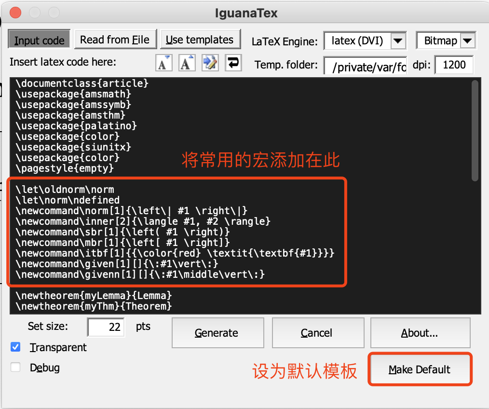

# 写作经验整理

## 语法

1. 行内公式或\emph中的内容最好放在一行，通过换表达方法避免换行
2. i.e.的平替：namely，that is，e.g.的平替：for example
3. equation是“方程”的意思，不要滥用，可以用equality/expression代替
4. e.g.的使用方法：xxxxxxxxxx, e.g., xxxxxxxx
5. However的转折意味很强，一般不轻易用，轻微的转折用nevertheless, but, while替代
6. Method/approach是方法论层面，algorithm是具体实现


## 不同环境

1. 本地+Github

   1. 合作方式：加入同一个GitHub仓库，pull之后在本地编译，修改之后push到远程
   2. 本地常用的IDE
      1. vscode
      2. sublime

   3. Github：推荐使用[GitHub Desktop](https://desktop.github.com)进行操作，比git命令行简洁
      1. 解决Github Desktop push/pull较慢的问题：将GitHub相关的域名IP写入host文件，参考[这篇博客](https://blog.csdn.net/hongxue8888/article/details/103855883)中的做法

2. overleaf

   1. [NJU LaTeX](https://tex.nju.edu.cn/)
      1. 优点：快
      2. 缺点：似乎同一份和overleaf官方网站编译的结果有格式上的差异？

   2. [overleaf](https://cn.overleaf.com/)
      1. 优点：准确
      2. 缺点：编译较慢，连接不稳定

3. [iguanatex](https://github.com/Jonathan-LeRoux/IguanaTex/blob/v1.60.2/README.md)

   1. 用途：用于在ppt中插入LaTeX公式

   2. 小技巧：

      1. 可以将常用的宏设为默认，以符合自己的使用习惯

      


## LaTeX技巧

1. 如果有很多章节，不同章节使用一个TeX文件单独写，使用input命令插入即可，使得文件的逻辑更加清晰
2. 使用\textbf{xxxx}~~ 可以达到与\paragraph{xxxx}类似的效果，区别在于段落间的间距更小，节省空间
3. 当需要插入多幅图片时

```latex
\begin{figure*}[!t]
  \centering
  \subfigure[nameA]{ 
      \label{fig:nameA} 
      \includegraphics[clip, trim=xcm xcm xcm xcm,width=0.3\textwidth]{nameA.pdf}}       
      \hspace{3mm}
  \subfigure[nameB]{ 
      \label{fig:nameB}
      \includegraphics[clip, trim=xcm xcm xcm xcm, width=0.3\textwidth]{nameB.pdf}}  
      \hspace{3mm}   
  \subfigure[nameC]{ 
      \label{fig:nameC}
      \includegraphics[clip, trim=xcm xcm xcm xcm, width=0.3\textwidth]{nameC.pdf}}
  \caption{My caption.}
  \label{fig:xxx}
\end{figure*}
```

其中trim的4个参数分别代表左下右上 

4. \setlength\itemsep{0em}

5. \setcounter{AlgoLine}{0}——从1开始

6. \paragraph and \textbf

7. \input

8. command file

9. 定义宏：

   1. \newcommand\sbr[1]{\left( #1 \right)}
   2. \newcommand\inner[2]{\langle #1, #2 \rangle}

   

   

### 图片

### 表格

1. 

## 写作经验

1. 如果一个大section中只有一个subsection，那么这样的结构就没有必要
2. 涉及到一个符号的时候，要加上一些描述性的信息
3. 如果段落最后一行只有两三个单词，想办法将其缩进上一行
4. 不要用next/last section，直接说 section x.x


