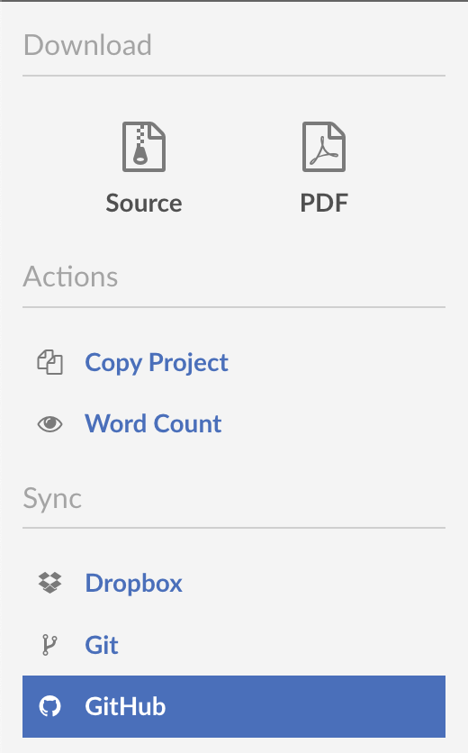
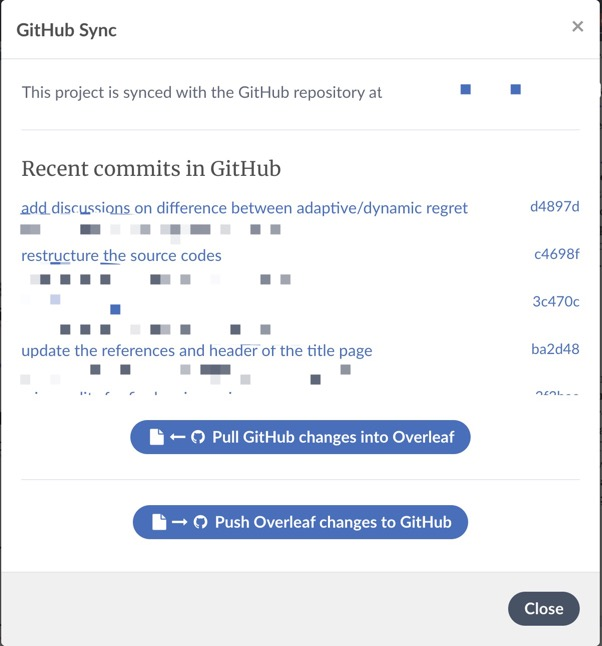

# 平台

本篇笔记主要介绍常用的LaTeX编译平台，具体包括两种：本地+Github、Overleaf。最后介绍两种平台之间的同步方式。

## 本地+Github
   
   1. 合作方式：加入同一个GitHub仓库，pull之后在本地编译，修改之后push到远程
   
   2. 本地常用的IDE
      
      1. [VSCode](./VSCode使用.md)
      2. [Sublime](./Sublime使用.md)
   
   3. Github：推荐使用[GitHub Desktop](https://desktop.github.com)进行操作，比git命令行简洁
      
      1. 解决Github Desktop push/pull较慢的问题：将GitHub相关的域名IP写入host文件，参考[这篇博客](https://blog.csdn.net/hongxue8888/article/details/103855883)中的做法——域名IP经常会变，当发现push/pull再次发生卡顿时，重新查询IP地址并且将其写入host文件

## Overleaf
   1. **两种选择**：[Overleaf](https://cn.overleaf.com/)与[NJU LaTeX](https://tex.nju.edu.cn/)
   2. **适合使用NJU LaTeX的场景**：打草稿阶段，需要快速得到编译结果。
   3. **适合使用Overleaf的场景**：在最终定稿阶段，Overleaf的编译结果最准确。相同的内容在两个平台上编译出来的篇幅是不同的，该问题目前仍未解决。
   4. **解锁无限合作者以及无限历史记录权限**：Overleaf官方规定如果能拉10个新用户，就可以解锁该权限，淘宝上有相关服务。
   

## Github和Overleaf之间的协作/同步

    1. 在Overleaf编辑页面点击菜单，可以看到如下选项：
    

  
    2. 点击"Github"选项，即可快速进行Github到Overleaf，或是Overleaf到Github的同步。
    

