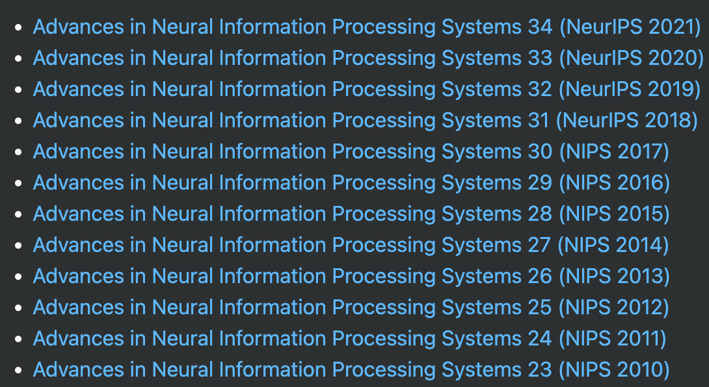

# Reference规范

## 会议
一些机器学习/学习理论著名会议：[AISTATS](#AISTATS), [COLT](#COLT), [NeurIPS](#NeurIPS), [ICML](#ICML), [AAAI](#ICML), [IJCAI](#IJCAI), [UAI](#UAI)等的引用规范

<span id="AISTATS">AISTATS</span>
```latex
  @inproceedings{AISTATS'11:smooth-BCO,
  author    = {Ankan Saha and
               Ambuj Tewari},
  title     = {Improved Regret Guarantees for Online Smooth Convex Optimization with
               Bandit Feedback},
  booktitle = {Proceedings of the 14th International Conference on Artificial Intelligence and Statistics (AISTATS)},
  pages     = {636--642},
  year      = {2011}
}
```

<span id="COLT">COLT</span>
```latex
  @inproceedings{COLT'21:Yu-Xiang,
  author    = {Dheeraj Baby and
               Yu{-}Xiang Wang},
  title     = {Optimal Dynamic Regret in Exp-Concave Online Learning},
  booktitle = {Proceedings of 34th Conference on Learning Theory (COLT)},
  pages     = {359--409},
  year      = {2021}
}
```

<span id="NeurIPS">NeurIPS</span>
```latex
@inproceedings{NIPS'15:OCOmemory,
  author    = {Oren Anava and
               Elad Hazan and
               Shie Mannor},
  title     = {Online Learning for Adversaries with Memory: Price of Past Mistakes},
  booktitle = {Advances in Neural Information Processing Systems 28 (NeurIPS)},
  pages     = {784--792},
  year      = {2015}
}
```
注：
1. 根据NeurIPS（现称）的标准，2017年及以前简称为NIPS，2018年开始简称NeurIPS

2. NeurIPS虽然是会议，但是其名称没有Proceedings of

<span id="ICML">ICML</span>
```latex
@inproceedings{ICML'19:online-control,
  author    = {Naman Agarwal and
               Brian Bullins and
               Elad Hazan and
               Sham M. Kakade and
               Karan Singh},
  title     = {Online Control with Adversarial Disturbances},
  booktitle = {Proceedings of the 36th International Conference on Machine Learning (ICML)},
  pages     = {111--119},
  year      = {2019}
}
```

<span id="AAAI">AAAI</span>
```latex
@inproceedings{AAAI'21:UnseenJob,
    author = {Yu-Jie Zhang and Yu-Hu Yan and Peng Zhao and Zhi-Hua Zhou},
    title = {Towards Enabling Learnware to Handle Unseen Jobs},
    booktitle = {Proceedings of the 35th AAAI Conference on Artificial Intelligence (AAAI)},
    year = {2021},
    pages = {10964--10972}
}
```

<span id="IJCAI">IJCAI</span>
```latex
@inproceedings{IJCAI'20:zhanglj-changing,
  author    = {Lijun Zhang},
  title     = {Online Learning in Changing Environments},
  booktitle = {Proceedings of the 29th International Joint Conference on Artificial Intelligence (IJCAI)},
  pages     = {5178--5182},
  year      = {2020}
}
```

<span id="UAI">UAI</span>
```latex
@inproceedings{UAI'20:SLB,
  author    = {Baekjin Kim and
               Ambuj Tewari},
  title     = {Randomized Exploration for Non-Stationary Stochastic Linear Bandits},
  booktitle = {Proceedings of the Thirty-Sixth Conference on Uncertainty in Artificial Intelligence (UAI)},
  pages     = {71--80},
  year      = {2020}
}
```

## 期刊
一些机器学习/学习理论著名期刊：[JMLR](#JMLR), [TPAMI](#TPAMI), [arXiv](#arXiv)等的引用规范

<span id="JMLR">JMLR</span>
```latex
@article{JMLR'21:BCO,
    author = {Peng Zhao and
              Guanghui Wang and
              Lijun Zhang and
              Zhi-Hua Zhou},
    title = {Bandit Convex Optimization in Non-stationary Environments},
    journal = {Journal of Machine Learning Research},
    volume = {22},
    number = {125},
    pages = {1 -- 45},
    year = {2021}
}
```

<span id="TPAMI">TPAMI</span>
```latex
@article{TPAMI'21:Safe,
    author = {Yu-Feng Li and
              Lan-Zhe Guo and
              Zhi-Hua Zhou},
    title = {Towards Safe Weakly Supervised Learning},
    journal   = {{IEEE} Transactions on Pattern Analysis and Machine Intelligence},
    volume = {43},
    number = {1},
    pages = {xxx -- xxx},
    year = {2021}
}
```

<span id="arXiv">arXiv</span>
```latex
@article{arXiv'22:rate-optimal,
  author    = {Asaf Cassel and
               Alon Cohen and
               Tomer Koren},
  title     = {Rate-Optimal Online Convex Optimization in Adaptive Linear Control},
  journal   = {ArXiv preprint},
  volume    = {arXiv:2206.01426},
  year      = {2022},
}
```
注：volume部分对应的是文章的arXiv网址，例如这篇文章的arXiv网址为：https://arxiv.org/abs/2206.01426