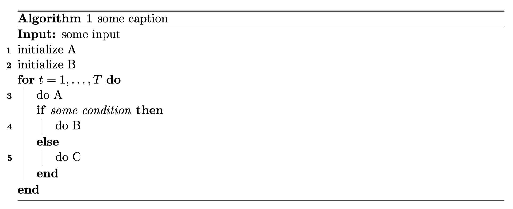

# 算法

## 不同算法包的区别
TODO

## 引用特定行
Haipeng Luo的文章中使用如下的方式编写算法，好处在于：每一行都可以有一个标签，在对算法进行描述时，可以精确引用到行。
```latex
\begin{algorithm}[t]
    \caption{some caption}
    \label{some label}
    \textbf{Input:} some input

    \nl initialize A \label{line:init-A}

    \nl initialize B \label{line:init-B}

    \For{$t=1, \ldots, T$}{
        \nl do A \label{line:do-A}

        \eIf{some condition}{
            \nl do B \label{line:do-B}
        }{
            \nl do C \label{line:do-C}
        }
    }
\end{algorithm}
```
编译出的效果为：
<div align=center></div>